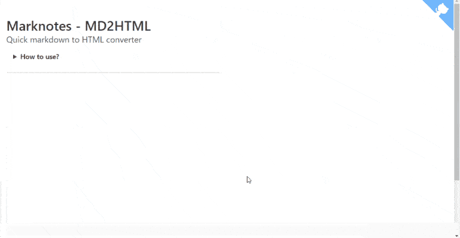

# marknotes_md2xls

> Quick markdown to HTML converter

**Conversion is made in javascript, no server side action needed so nothing is sent to internet.**

## Table of Contents

- [Install](#install)
- [Usage](#usage)
- [Tips](#tips)
- [License](#license)

## Install

Clone this repository or just get a copy of the <a href="https://raw.githubusercontent.com/cavo789/marknotes_md2html/master/index.php" target="_blank noreferrer noopener">index.php</a> and store the file, f.i., on your localhost.

You can also use the [interface online](https://www.avonture.be/marknotes_md2html) without installing anything.

## Usage

1. Type your markdown code in the editor,
2. Click on Convert to get the HTML rendering,
3. Click on the Copy to clipboard button so you can paste the HTML rendering in an email f.i.

## Tips

- You can type something like `==important part==` to put that section in a highlighted section.
- When the markdown content start with a YAML block, that block is ignored during the HTML conversion

## License

[MIT](LICENSE)
